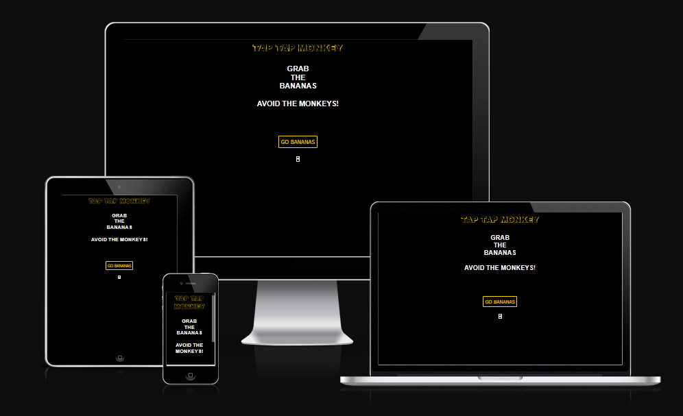
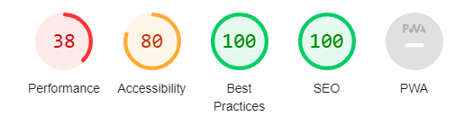

 

Welcome to the read me for Tap Tap Monkey. 

This documents outlines the goals of the website and its functionality throughout. 

------
## Core Aims 

Tap Tap Monkey is intended to be a simple to play game, on all devices, where the user has to test their reaction skills by clicking randomly changing images of bananas and avoiding monkeys. 

The core aim of the site is to provide a simple game for people to enjoy while they have a few minutes to relax, for example when on the bus, waiting for an appointment etc. 

 

The site is fully responsive across all devices and maintains good resizing and positioning throughout. It is also purposefully designed to fit on a mobile screen without need for scrolling. 

------
## Features

<strong>Navigation</strong> 
There is no navigation menu. Instead, there is a straightforward progression for the user, broken into three stages: Start screen, game play, game over screen. 

<strong>Site Fonts</strong> 
We use Sans Serif as our primary font throughout the site. 

<strong>Colors</strong>  
There is a constant colour structure throughout the site of Gold and Black. White is used ocassionally, for elements like audio control, and when buttons are hovered / clicked. 

<strong>Header</strong>  
The header shows the site title and also includes a selection of keywords related to games. It is clear who the site is targeted towards. 

<strong>Iconography</strong>  
Icons are used from: https://fontawesome.com 

We use a banana icon and monkey icon, each in two variations of black and white, or black and yellow. 

<strong>Animations</strong>  
Animation effects are used from: https://animate.style/ 

We use a text animation to shake the Tap Tap Monkey title upon first load of the webpage. 

We use other animations in the game itself. If a user clicks a banana it shoots upward, if they click a monkey it shoots downward. This UX is intended to reenforce the main aim of the game - to click bananas, not monkeys. 

<strong>Sounds</strong> 
Sound effects are from: https://pixabay.com/sound-effects/ 

We use two audio files to further reenforce the UX of clicking bananas and monkeys. 

Bananas make a yippee sound, monkeys make a squeel sound. 

<strong>Start screen</strong>  
This section shows our animated title and gives a simple introduction to the game rules. 

There is also a Go Bananas button for users to commence playing. 

<strong>Gameplay</strong>  
The game uses a layout of 3 x 3 buttons. Each button is a randomised rotation of four images, two bananas, two monkeys. Users begin the game with a score of zero bananas and a score of 5 lives. If they click a banana image, their banana score increases and is displayed in a large yellow number at the top of the screen. If they click a monkey, their monkey lives score is reduced, shown in the red score at the bottom of the screen. The game ends when they have clicked five monkeys.
 

<strong>Game Over</strong>  
The game over screen shows the user how many bananas they collected. 

It also shows a play again button, which when clicked refreshes the whole site and therefore returns the scores to their original state. 

------
## Testing

I have tested the site across multiple devices of different sizes, and a variety of popular browsers. The site performs well across all. 

<strong>Responsiveness</strong>  Confirmed across multiple devices. 

<strong>Buttons on all screens - including gameplay</strong>  All are functional and easy to understand. 

<strong>Unfixed bugs</strong>  I am having a problem toggling the mute button to different colours depending on its state. 

------
## Testing
 

CSS - When we run it through the w3c validator we have multiple errors to resolve. 

HTML - When we run it through the w3c validator we have multiple errors to resolve. 

<strong>Accessibility</strong>  We used google chrome's lighthouse tool and ranked as follows: 
    <strong>Performance:</strong> 38/100 (The main issue is the number of javascript funtions running. I need to try and run the same script for each button, instead of one each.) 
    <strong>Accessibility:</strong> 80/100 (The main issue appears to be with the labelling of the audio button. We use an icon instead of a text word, making it hard to understand for blind users. I need to fix that.) 
    <strong>Best Practices:</strong> 100/100 
    <strong>SEO:</strong> 100/100 

------
## Deployment

The site is deployed to Github pages, accessible via: https://rggg1.github.io/hi-lo-game 

The source files are available here: https://github.com/RGGG1/hi-lo-game 

## References
 
I used the following resources to find solutions to various parts of the game UI / UX.  

https://codepen.io/TajShireen/pen/LYyOzJL - title font effect
https://fontawesome.com/icons/banana?f=classic&s=duotone&pc=%23ffffff&sc=%23ffffff&po=1&so=0.6 - banana icon
https://fontawesome.com/icons/monkey?f=classic&s=solid&pc=%23ffff06 - Monkey icon
https://codepen.io/houssem93171714/pen/abZZEaz - for image transition effect
https://codepen.io/SitePoint/pen/zqVGQK - slider inside button effect
https://developer.mozilla.org/en-US/docs/Web/CSS/opacity - to fix opacity on slider images
https://codepen.io/dajreamdigital/pen/jvqKLX - hide button functionality
https://bobbyhadz.com/blog/javascript-hide-button-after-click - hide button functionality
https://stackoverflow.com/questions/12953928/immediate-play-sound-on-button-click-in-html-page - audio functionality
https://stackoverflow.com/questions/14044761/how-to-mute-all-sound-in-a-page-with-js - mute control